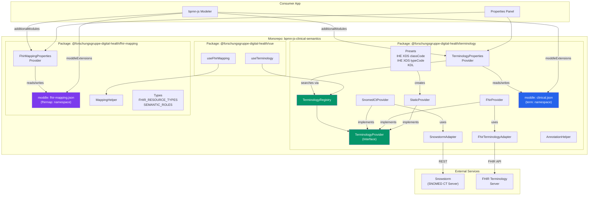
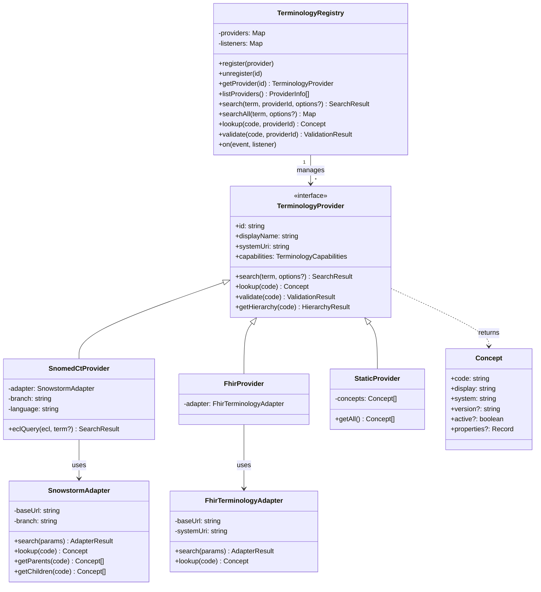

# Architecture

This document describes the design decisions, component architecture, data model, and project structure of **bpmn-js-clinical-semantics**. It is intended for contributors, integrators, and anyone interested in understanding how the libraries work under the hood.

For usage instructions, see the [README](README.md). For contributor workflow, see [CONTRIBUTING.md](CONTRIBUTING.md).

---

## Table of Contents

- [Motivation and Background](#motivation-and-background)
- [Design Decisions](#design-decisions)
- [Package Overview](#package-overview)
- [Terminology Provider Architecture](#terminology-provider-architecture)
- [Annotation and Mapping Data Model](#annotation-and-mapping-data-model)
- [Project Structure](#project-structure)
- [Package Details](#package-details)
- [Extending with a New Terminology System](#extending-with-a-new-terminology-system)
- [Generated XML](#generated-xml)
- [Design Principles](#design-principles)

---

## Motivation and Background

### The Gap Between BPMN and Clinical Semantics

BPMN 2.0 has become the standard notation for modelling clinical pathways in hospitals, cancer centers, and health networks. Multidisciplinary teams use it to document diagnostic, staging, therapy, follow-up, palliative, preventive, and rehabilitation workflows. However, standard BPMN elements carry no clinical semantics. A `Task` labelled "CT-Thorax" is just a human-readable string: there is no machine-readable link to a SNOMED CT procedure code, no classification as an IHE XDS document type, and no mapping to a FHIR `DiagnosticReport` resource.

This limitation makes BPMN diagrams unreliable as a single source of truth for clinical process automation, decision support, and interoperability. When clinical pathways are revised, downstream systems (EHR integration engines, clinical data repositories, document registries) cannot determine whether a BPMN element has changed semantically or merely been relabelled. Regulatory audits, cross-institutional pathway comparisons, and automated conformance checking all require formalised semantics that plain BPMN cannot provide.

### The Problem in Practice

Consider a university hospital modelling its lung cancer diagnostic pathway. The pathway includes tasks like "CT-Thorax mit Kontrastmittel", data objects like "CT-Befundbericht", and decision gateways evaluating malignancy. Without formal annotations, three concrete problems arise:

1. **No interoperability.** A pathway exchange between institutions loses its meaning because the clinical codes behind each element are not embedded in the BPMN XML. Institution A uses SNOMED CT; institution B uses OPS. Neither can automatically map the other's process elements.

2. **No FHIR bridge.** Modern health IT infrastructure speaks FHIR. A BPMN task that creates a diagnostic report should declare which FHIR resource it produces (`DiagnosticReport`), which profile constrains it (e.g. MII KDS), and which key elements it populates (`DiagnosticReport.status = final`). Without this, the gap between process model and implementation must be bridged manually.

3. **No document classification.** Clinical document management systems rely on standardised type codes (IHE XDS classCode/typeCode, KDL). When a BPMN data object represents a clinical report, its document class should be part of the model, not a separate mapping table that drifts out of sync.

### How This Project Addresses It

**bpmn-js-clinical-semantics** closes these gaps by adding two optional, standards-based annotation layers to any BPMN model:

1. **Terminology annotations** (`term:` namespace) enrich BPMN elements with codes from SNOMED CT, LOINC, ICD-10-GM, OPS, IHE XDS, KDL, or any other code system. Each annotation carries an aspect (what facet is being annotated), a mode (descriptive vs. prescriptive), optional free text, and zero or more coded entries with their code system URI.

2. **FHIR resource mappings** (`fhirmap:` namespace) declare which FHIR resource type, profile, interaction pattern, and key elements a BPMN element represents. This enables downstream tooling to generate FHIR transaction bundles, StructureMap references, or SearchParameter queries directly from the process model.

Both annotation layers are stored as BPMN 2.0 `extensionElements` in the standard XML format. Non-clinical BPMN tools simply ignore them; clinical tools can read and process them. The approach preserves full backwards compatibility with every BPMN 2.0 engine and viewer.

---

## Design Decisions

**Monorepo with npm workspaces.** The three packages share a development lifecycle and are versioned together, but they are published independently. A consumer that only needs terminology annotations does not pull in the FHIR mapping code, and vice versa. The Vue package is optional for projects that use a different frontend framework.

**Separate XML namespaces.** Terminology annotations use the `term:` prefix (URI `https://clinical-bpmn.org/terminology/v1`) and FHIR mappings use the `fhirmap:` prefix (URI `https://clinical-bpmn.org/fhir-mapping/v1`). This keeps the two concerns decoupled in the BPMN XML and allows each layer to evolve independently.

**BPMN 2.0 extensionElements as the persistence mechanism.** Rather than inventing a sidecar format, both annotation layers use standard BPMN `extensionElements`. This means the annotated XML is still valid BPMN 2.0, can be opened in any compliant tool, and the annotations survive round-trip editing in tools that do not understand them.

**Provider/Adapter pattern for terminology access.** The `TerminologyProvider` interface defines a uniform contract (search, lookup, validate, getHierarchy). Concrete providers (`SnomedCtProvider`, `FhirProvider`, `StaticProvider`) implement this interface and optionally delegate to protocol-specific adapters (`SnowstormAdapter`, `FhirTerminologyAdapter`). This two-layer design means a new terminology system can often be added by configuring an existing adapter rather than writing an entirely new provider.

**Registry as a facade.** The `TerminologyRegistry` aggregates all providers and exposes `search`, `searchAll`, `lookup`, and `validate` as a single entry point. The properties panel depends on this abstraction, not on individual providers (Dependency Inversion Principle).

---

## Package Overview



---

## Terminology Provider Architecture



---

## Annotation and Mapping Data Model

The following diagram shows both extension element hierarchies side by side. Both attach to BPMN elements via `extensionElements` and are fully independent of each other.

```mermaid
classDiagram
    class `bpmn:FlowNode` {
        +term:clinicalDomain?: string
    }

    class `term:Annotations` {
        +values: Annotation[0..*]
    }

    class `term:Annotation` {
        +aspect: string
        +mode: "descriptive" | "prescriptive"
        +text?: string
        +codings: Coding[0..*]
    }

    class `term:Coding` {
        +system: string
        +code: string
        +display?: string
        +version?: string
    }

    class `fhirmap:ResourceMappings` {
        +mappings: ResourceMapping[0..*]
    }

    class `fhirmap:ResourceMapping` {
        +resourceType: string
        +profile?: string
        +interaction?: string
        +direction?: string
        +structureMapRef?: string
        +keyElements: KeyElement[0..*]
        +searchParams: SearchParam[0..*]
    }

    class `fhirmap:KeyElement` {
        +path: string
        +semanticRole?: string
        +fixedValue?: string
        +terminologyBinding?: string
        +terminologyAspect?: string
    }

    class `fhirmap:SearchParam` {
        +name: string
        +value: string
    }

    `bpmn:FlowNode` "1" --> "0..1" `term:Annotations` : extensionElements
    `bpmn:FlowNode` "1" --> "0..1" `fhirmap:ResourceMappings` : extensionElements
    `term:Annotations` "1" --> "*" `term:Annotation`
    `term:Annotation` "1" --> "*" `term:Coding`
    `fhirmap:ResourceMappings` "1" --> "*" `fhirmap:ResourceMapping`
    `fhirmap:ResourceMapping` "1" --> "*" `fhirmap:KeyElement`
    `fhirmap:ResourceMapping` "1" --> "*" `fhirmap:SearchParam`

    style `term:Annotations` fill:#2563eb,color:#fff
    style `term:Annotation` fill:#2563eb,color:#fff
    style `term:Coding` fill:#2563eb,color:#fff
    style `fhirmap:ResourceMappings` fill:#7c3aed,color:#fff
    style `fhirmap:ResourceMapping` fill:#7c3aed,color:#fff
    style `fhirmap:KeyElement` fill:#7c3aed,color:#fff
    style `fhirmap:SearchParam` fill:#7c3aed,color:#fff
```

---

## Project Structure

```
bpmn-js-clinical-semantics/
|
+-- packages/
|   +-- terminology/                  @forschungsgruppe-digital-health/terminology
|   |   +-- src/
|   |   |   +-- core/                 TerminologyProvider (interface), TerminologyRegistry, types
|   |   |   +-- adapters/             SnowstormAdapter, FhirTerminologyAdapter
|   |   |   +-- providers/            SnomedCtProvider, FhirProvider, StaticProvider
|   |   |   |   +-- presets/          Factory functions for IHE XDS classCode/typeCode, KDL
|   |   |   +-- moddle/               clinical.json  -- BPMN moddle extension (term: namespace)
|   |   |   +-- properties-panel/     TerminologyPropertiesProvider, UI entries
|   |   |   +-- services/             AnnotationHelper (read/write annotations on businessObjects)
|   |   +-- test/                     Unit tests (139 tests)
|   |
|   +-- fhir-mapping/                 @forschungsgruppe-digital-health/fhir-mapping
|   |   +-- src/
|   |   |   +-- core/                 types (FHIR_RESOURCE_TYPES, INTERACTIONS, DIRECTIONS, SEMANTIC_ROLES)
|   |   |   +-- moddle/               fhir-mapping.json  -- BPMN moddle extension (fhirmap: namespace)
|   |   |   +-- properties-panel/     FhirMappingPropertiesProvider, UI entries
|   |   |   +-- services/             MappingHelper (read/write/export FHIR mappings)
|   |   +-- test/                     Unit tests (34 tests)
|   |
|   +-- vue/                          @forschungsgruppe-digital-health/vue
|       +-- src/composables/          useTerminology(), useFhirMapping()
|
+-- examples/
|   +-- vanilla/                      Interactive demo app (Vite + bpmn-js)
|       +-- src/app.js                Modeler setup with both extensions
|       +-- public/sample.bpmn        Sample lung cancer diagnostic pathway
|       +-- index.html                Demo UI
|
+-- docs/                             Built demo app for GitHub Pages (generated, not committed)
|
+-- .github/
|   +-- workflows/
|       +-- ci.yml                    CI: lint, test, build (Node 18 + 20)
|       +-- deploy.yml                GitHub Pages deployment on push to main
|
+-- ARCHITECTURE.md                   This file
+-- CONTRIBUTING.md                   Development, packaging, and release guide
+-- LICENSE                           Apache License 2.0
+-- README.md                         Project overview and quick start
```

**Why three packages?** The terminology engine and the FHIR mapping layer solve different problems and have different dependency footprints. A project that only needs terminology search (e.g. a coding assistant widget) should not be forced to pull in FHIR mapping types. Conversely, a project that only needs to declare resource-level FHIR mappings does not need the Snowstorm adapter or FHIR terminology client. The Vue package is framework-specific and only relevant to Vue 3 consumers. The monorepo structure keeps development convenient while allowing independent consumption.

---

## Package Details

### `@forschungsgruppe-digital-health/terminology`

Extensible terminology annotation engine. Each BPMN element can carry multiple annotations, each with:

- **`aspect`** -- which semantic facet is annotated: `clinicalContent`, `documentClass`, `documentType`, `note`, `confidentiality`, `status`, `format`, `participant`, or custom values
- **`mode`** -- `descriptive` (documentation only) or `prescriptive` (normative, with optional mapping target)
- **`text`** -- free-text description (always available, no code system required)
- **`codings`** -- 0..* codes from any registered terminology system
- **`target`** -- optional FHIRPath mapping rule with `element`, `transform` (`copy` | `fixed` | `translate` | `reference`), and `value`

**Included providers:**

| Provider | Class | Server required | Codes |
|---|---|---|---|
| SNOMED CT | `SnomedCtProvider` | Yes (Snowstorm) | via API |
| LOINC, ICD-10-GM, OPS, ATC, ICD-O-3 | `FhirProvider` | Yes (any FHIR TS) | via API |
| IHE XDS classCode | `createIheXdsClassCodeProvider()` | No | 16 built-in |
| IHE XDS typeCode | `createIheXdsTypeCodeProvider()` | No | 22 built-in |
| KDL (DVMD) | `createKdlProvider()` | No | 18 built-in (full set loadable from FHIR) |

Adding a new terminology system requires zero changes to existing code. Implement `TerminologyProvider` and call `registry.register()`. For FHIR-hosted code systems, reuse `FhirProvider`. For small static code systems, use `StaticProvider`.

### `@forschungsgruppe-digital-health/fhir-mapping`

FHIR resource-level mapping. Each BPMN element can declare:

- **`resourceType`** -- which FHIR resource it represents (16 types including `Condition`, `Procedure`, `Observation`, `DiagnosticReport`, `DocumentReference`, `MedicationRequest`, `ServiceRequest`, `CarePlan`, `Composition`, `Bundle`, `ImagingStudy`, `Consent`, `Patient`, `Encounter`, `Specimen`)
- **`profile`** -- canonical URL of the applicable FHIR profile (e.g. MII KDS profiles)
- **`interaction`** -- FHIR interaction type: `create`, `read`, `update`, `search`, `transaction`
- **`direction`** -- data flow direction: `input`, `output`, `input-output`
- **`structureMapRef`** -- canonical URL of a FHIR StructureMap for automated transformation
- **`keyElements`** -- FHIRPath elements with semantic roles (`trigger`, `filter`, `classifier`, `identifier`, `payload`), fixed values, and terminology bindings
- **`searchParams`** -- FHIR SearchParameters for `search`-type interactions

### `@forschungsgruppe-digital-health/vue`

Thin Vue 3 wrapper providing `useTerminology()` and `useFhirMapping()` composables for building custom sidebars or search UIs. Both composables react to the bpmn-js selection and expose reactive state.

---

## Extending with a New Terminology System

### Option A: FHIR-hosted code system (no custom adapter)

```js
import { FhirProvider, TerminologyRegistry } from '@forschungsgruppe-digital-health/terminology';

const registry = new TerminologyRegistry();

registry.register(new FhirProvider({
  id: 'atc',
  displayName: 'ATC/DDD',
  systemUri: 'http://fhir.de/CodeSystem/bfarm/atc',
  baseUrl: 'https://fhir.bfarm.de/fhir'
}));
```

### Option B: Static code system (no server)

```js
import { StaticProvider } from '@forschungsgruppe-digital-health/terminology';

registry.register(new StaticProvider(
  'my-codes',
  'My Custom Codes',
  'http://example.com/my-codesystem',
  [
    { code: 'A1', display: 'Alpha One', system: 'http://example.com/my-codesystem' },
    { code: 'B2', display: 'Beta Two', system: 'http://example.com/my-codesystem' }
  ]
));
```

### Option C: Custom API (new adapter + provider)

```js
import { TerminologyProvider } from '@forschungsgruppe-digital-health/terminology';

class OncotreeProvider extends TerminologyProvider {
  get id() { return 'oncotree'; }
  get displayName() { return 'OncoTree'; }
  get systemUri() { return 'http://oncotree.mskcc.org'; }
  get capabilities() { return { search: true, lookup: true, hierarchy: true, validate: true }; }

  async search(term, options) {
    const res = await fetch(`https://oncotree.info/api/tumorTypes/search?query=${term}`);
    const data = await res.json();
    return {
      concepts: data.map(d => ({ code: d.code, display: d.name, system: this.systemUri })),
      total: data.length
    };
  }

  async lookup(code) {
    const res = await fetch(`https://oncotree.info/api/tumorTypes/${code}`);
    if (!res.ok) return null;
    const d = await res.json();
    return { code: d.code, display: d.name, system: this.systemUri };
  }
}

registry.register(new OncotreeProvider());
```

In all three cases, zero changes to existing library code are required (Open/Closed Principle).

---

## Generated XML

When annotations and mappings are added via the properties panel, they are persisted as standard BPMN 2.0 extension elements:

```xml
<bpmn2:dataObject id="DataObj_Befund" name="CT-Befundbericht"
                  xmlns:term="https://clinical-bpmn.org/terminology/v1"
                  xmlns:fhirmap="https://clinical-bpmn.org/fhir-mapping/v1"
                  term:clinicalDomain="diagnostics">
  <bpmn2:extensionElements>

    <!-- Terminology annotations -->
    <term:annotations>
      <term:annotation aspect="clinicalContent" mode="descriptive"
                       text="CT-Befund Thorax mit KM">
        <term:coding system="http://snomed.info/sct"
                     code="169069000" display="CT of chest (procedure)"/>
      </term:annotation>
      <term:annotation aspect="documentType" mode="prescriptive">
        <term:coding system="http://dvmd.de/fhir/CodeSystem/kdl"
                     code="DG020106" display="Ergebnis bildgebender Diagnostik"/>
      </term:annotation>
    </term:annotations>

    <!-- FHIR resource mapping -->
    <fhirmap:resourceMappings>
      <fhirmap:resourceMapping resourceType="DiagnosticReport"
                               interaction="create" direction="output">
        <fhirmap:keyElement path="DiagnosticReport.status"
                           semanticRole="trigger" fixedValue="final"/>
      </fhirmap:resourceMapping>
    </fhirmap:resourceMappings>

  </bpmn2:extensionElements>
</bpmn2:dataObject>
```

The two namespaces (`term:` and `fhirmap:`) are independent. Non-clinical BPMN tools will ignore them and preserve them on re-save.

---

## Design Principles

| Principle | Implementation |
|---|---|
| **Single Responsibility** | `TerminologyProvider` searches codes. `TerminologyAdapter` talks to servers. `TerminologyRegistry` manages providers. `AnnotationHelper` reads/writes XML. `MappingHelper` reads/writes FHIR mappings. Each class has one job. |
| **Open/Closed** | New terminology systems are added by implementing `TerminologyProvider` and calling `registry.register()`. No existing files are modified. `aspect` values are extensible strings, not a closed enum. |
| **Liskov Substitution** | `SnomedCtProvider`, `FhirProvider`, and `StaticProvider` are all interchangeable wherever `TerminologyProvider` is expected. The registry treats all providers identically. |
| **Interface Segregation** | `TerminologyProvider` has four methods (`search`, `lookup`, `validate`, `getHierarchy`), two of which have default implementations. The `capabilities` object declares which methods are meaningful. |
| **Dependency Inversion** | The properties panel depends on `TerminologyRegistry` (abstraction), not on `SnomedCtProvider` (implementation). Adapters are injected into providers via constructor configuration. |
| **Separation of Concerns** | Terminology annotations and FHIR mappings are separate packages with separate moddle namespaces. They can be used independently or together. |
