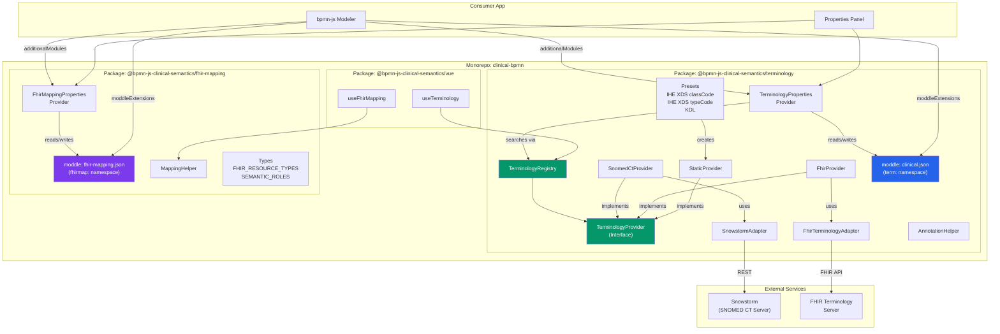
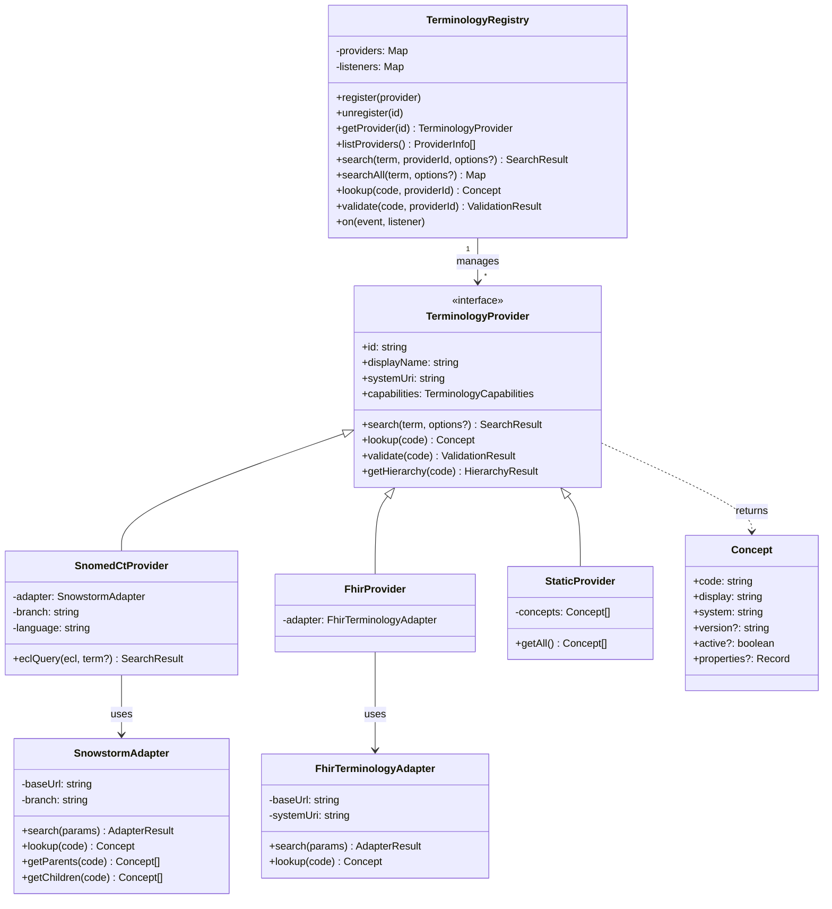
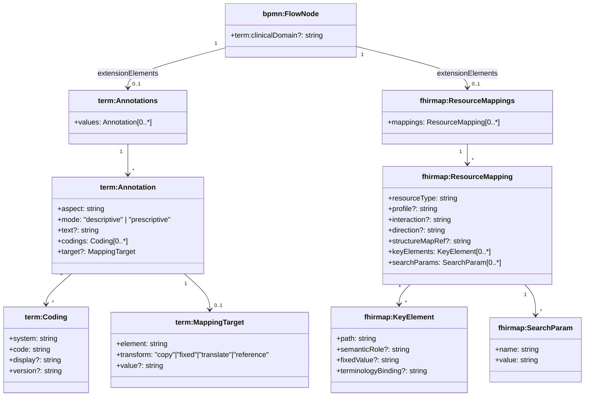

# clinical-bpmn

[](https://github.com/forschungsgruppe-digital-health/bpmn-js-clinical-semantics/actions/workflows/ci.yml)
[](https://opensource.org/licenses/Apache-2.0)

**Semantic clinical annotations and FHIR resource mapping for BPMN process models.**

Two independent [bpmn-js](https://github.com/bpmn-io/bpmn-js) extension libraries that add clinical context to BPMN diagrams – without modifying the BPMN standard. Each library provides a moddle extension (for XML serialization) and a properties panel provider (for interactive editing).

> **Live Demo:** [→ GitHub Pages](#github-pages-deployment)

---

## Motivation

BPMN 2.0 is widely used to model clinical pathways (diagnostics, staging, therapy, follow-up). But standard BPMN elements carry no clinical semantics: a `Task` named "CT-Thorax" is just a label – there is no machine-readable link to SNOMED CT, no classification as IHE XDS document type, no mapping to a FHIR `Procedure` resource.

**clinical-bpmn** closes this gap by adding two optional, standards-based annotation layers to any BPMN model:

1. **Terminology annotations** (`term:`) – enrich elements with codes from SNOMED CT, LOINC, ICD-10-GM, OPS, IHE XDS, KDL, or any other code system
2. **FHIR resource mappings** (`fhirmap:`) – declare which FHIR resource type, profile, and key elements a BPMN element represents

Both layers are stored as BPMN 2.0 `extensionElements` in the standard XML format. Non-clinical BPMN tools ignore them; clinical tools can read and process them.

---

## Architecture

### Package Overview



### Class Diagram: Terminology Provider Architecture



### Annotation Data Model



---

## Packages

### `@bpmn-js-clinical-semantics/terminology`

Extensible terminology annotation engine. Each BPMN element can carry multiple annotations, each with:

- **`aspect`** – which semantic facet is annotated (`clinicalContent`, `documentClass`, `documentType`, `note`, or custom values)
- **`mode`** – `descriptive` (documentation only) or `prescriptive` (normative, with optional mapping target)
- **`text`** – free-text description (always available, no code system required)
- **`codings`** – 0..\* codes from any registered terminology system
- **`target`** – optional FHIRPath mapping rule with `element`, `transform` (`copy` | `fixed` | `translate` | `reference`), and `value`

**Included providers:**

| Provider                            | Class                             | Server required   | Codes                                     |
| ----------------------------------- | --------------------------------- | ----------------- | ----------------------------------------- |
| SNOMED CT                           | `SnomedCtProvider`                | Yes (Snowstorm)   | via API                                   |
| LOINC, ICD-10-GM, OPS, ATC, ICD-O-3 | `FhirProvider`                    | Yes (any FHIR TS) | via API                                   |
| IHE XDS classCode                   | `createIheXdsClassCodeProvider()` | No                | 16 built-in                               |
| IHE XDS typeCode                    | `createIheXdsTypeCodeProvider()`  | No                | 22 built-in                               |
| KDL (DVMD)                          | `createKdlProvider()`             | No                | 18 built-in (full set loadable from FHIR) |

**Adding a new terminology system requires zero changes to existing code.** Implement `TerminologyProvider` and call `registry.register()`. For FHIR-hosted code systems, reuse `FhirProvider`. For small static code systems, use `StaticProvider`.

### `@bpmn-js-clinical-semantics/fhir-mapping`

FHIR resource-level mapping. Each BPMN element can declare:

- **`resourceType`** – which FHIR resource it represents (e.g. `DiagnosticReport`, `Procedure`, `DocumentReference`)
- **`profile`** – canonical URL of the applicable FHIR profile (e.g. MII KDS)
- **`interaction`** – FHIR interaction type (`create`, `read`, `update`, `search`, `transaction`)
- **`direction`** – data flow direction (`input`, `output`, `input-output`)
- **`keyElements`** – FHIRPath elements with semantic roles (`trigger`, `filter`, `classifier`, `identifier`, `payload`)
- **`searchParams`** – FHIR SearchParameters for locating the resource

### `@bpmn-js-clinical-semantics/vue`

Thin Vue 3 wrapper providing `useTerminology()` and `useFhirMapping()` composables for building custom sidebars or search UIs.

---

## Quick Start

### Prerequisites

- Node.js ≥ 18

### Run the demo locally

```bash
git clone https://github.com/forschungsgruppe-digital-health/bpmn-js-clinical-semantics.git
cd bpmn-js-clinical-semantics
npm install --legacy-peer-deps
cd examples/vanilla
npm run dev
```

Open `http://localhost:5173`. Click any BPMN element to see the annotation and mapping panels.

### Use in your own project

```bash
npm install @bpmn-js-clinical-semantics/terminology @bpmn-js-clinical-semantics/fhir-mapping
```

```js
import BpmnModeler from "bpmn-js/lib/Modeler";
import {
  BpmnPropertiesPanelModule,
  BpmnPropertiesProviderModule,
} from "bpmn-js-properties-panel";

import {
  TerminologyModdleDescriptor,
  TerminologyPropertiesPanelModule,
} from "@bpmn-js-clinical-semantics/terminology";

import {
  FhirMappingModdleDescriptor,
  FhirMappingPropertiesPanelModule,
} from "@bpmn-js-clinical-semantics/fhir-mapping";

const modeler = new BpmnModeler({
  container: "#canvas",
  propertiesPanel: { parent: "#properties" },
  additionalModules: [
    BpmnPropertiesPanelModule,
    BpmnPropertiesProviderModule,
    TerminologyPropertiesPanelModule, // ← adds "Klinische Annotation" group
    FhirMappingPropertiesPanelModule, // ← adds "FHIR Resource Mapping" group
  ],
  moddleExtensions: {
    term: TerminologyModdleDescriptor, // ← term: namespace in XML
    fhirmap: FhirMappingModdleDescriptor, // ← fhirmap: namespace in XML
  },
});
```

Each package can also be used independently – omit either `additionalModules` entry and its corresponding `moddleExtensions` entry.

---

## Extending with a New Terminology System

### Option A: FHIR-hosted code system (no custom adapter)

```js
import {
  FhirProvider,
  TerminologyRegistry,
} from "@bpmn-js-clinical-semantics/terminology";

const registry = new TerminologyRegistry();

registry.register(
  new FhirProvider({
    id: "atc",
    displayName: "ATC/DDD",
    systemUri: "http://fhir.de/CodeSystem/bfarm/atc",
    baseUrl: "https://fhir.bfarm.de/fhir",
  }),
);
```

### Option B: Static code system (no server)

```js
import { StaticProvider } from "@bpmn-js-clinical-semantics/terminology";

registry.register(
  new StaticProvider(
    "my-codes",
    "My Custom Codes",
    "http://example.com/my-codesystem",
    [
      {
        code: "A1",
        display: "Alpha One",
        system: "http://example.com/my-codesystem",
      },
      {
        code: "B2",
        display: "Beta Two",
        system: "http://example.com/my-codesystem",
      },
    ],
  ),
);
```

### Option C: Custom API (new adapter + provider)

```js
import { TerminologyProvider } from "@bpmn-js-clinical-semantics/terminology";

class OncotreeProvider extends TerminologyProvider {
  get id() {
    return "oncotree";
  }
  get displayName() {
    return "OncoTree";
  }
  get systemUri() {
    return "http://oncotree.mskcc.org";
  }
  get capabilities() {
    return { search: true, lookup: true, hierarchy: true, validate: true };
  }

  async search(term, options) {
    const res = await fetch(
      `https://oncotree.info/api/tumorTypes/search?query=${term}`,
    );
    const data = await res.json();
    return {
      concepts: data.map((d) => ({
        code: d.code,
        display: d.name,
        system: this.systemUri,
      })),
      total: data.length,
    };
  }

  async lookup(code) {
    const res = await fetch(`https://oncotree.info/api/tumorTypes/${code}`);
    if (!res.ok) return null;
    const d = await res.json();
    return { code: d.code, display: d.name, system: this.systemUri };
  }
}

registry.register(new OncotreeProvider());
```

In all three cases: **zero changes to existing library code** (Open/Closed Principle).

---

## Generated XML

When annotations and mappings are added via the properties panel, they are persisted as standard BPMN 2.0 extension elements:

```xml
<bpmn2:dataObject id="DataObj_Befund" name="CT-Befundbericht"
                  xmlns:term="https://clinical-bpmn.org/terminology/v1"
                  xmlns:fhirmap="https://clinical-bpmn.org/fhir-mapping/v1"
                  term:clinicalDomain="diagnostics">
  <bpmn2:extensionElements>

    <!-- @bpmn-js-clinical-semantics/terminology -->
    <term:annotations>
      <term:annotation aspect="clinicalContent" mode="descriptive"
                       text="CT-Befund Thorax mit KM">
        <term:coding system="http://snomed.info/sct"
                     code="169069000" display="CT of chest (procedure)"/>
      </term:annotation>
      <term:annotation aspect="documentType" mode="prescriptive">
        <term:coding system="http://dvmd.de/fhir/CodeSystem/kdl"
                     code="DG020106" display="Ergebnis bildgebender Diagnostik"/>
        <term:target element="DocumentReference.type" transform="copy"/>
      </term:annotation>
    </term:annotations>

    <!-- @bpmn-js-clinical-semantics/fhir-mapping -->
    <fhirmap:resourceMappings>
      <fhirmap:resourceMapping resourceType="DiagnosticReport"
                               interaction="create" direction="output">
        <fhirmap:keyElement path="DiagnosticReport.status"
                           semanticRole="trigger" fixedValue="final"/>
      </fhirmap:resourceMapping>
    </fhirmap:resourceMappings>

  </bpmn2:extensionElements>
</bpmn2:dataObject>
```

The two namespaces (`term:` and `fhirmap:`) are independent. Non-clinical BPMN tools will ignore them and preserve them on re-save.

---

## Project Structure

```
clinical-bpmn/
├── packages/
│   ├── terminology/                  @bpmn-js-clinical-semantics/terminology
│   │   └── src/
│   │       ├── core/                 TerminologyProvider, TerminologyRegistry, types
│   │       ├── adapters/             SnowstormAdapter, FhirTerminologyAdapter
│   │       ├── providers/            SnomedCtProvider, FhirProvider, StaticProvider
│   │       │   └── presets/          IHE XDS classCode/typeCode, KDL
│   │       ├── moddle/              clinical.json (term: namespace)
│   │       ├── properties-panel/     TerminologyPropertiesProvider, entries
│   │       └── services/             AnnotationHelper
│   │
│   ├── fhir-mapping/                 @bpmn-js-clinical-semantics/fhir-mapping
│   │   └── src/
│   │       ├── core/                 types (FHIR_RESOURCE_TYPES, SEMANTIC_ROLES, ...)
│   │       ├── moddle/              fhir-mapping.json (fhirmap: namespace)
│   │       ├── properties-panel/     FhirMappingPropertiesProvider, entries
│   │       └── services/             MappingHelper
│   │
│   └── vue/                          @bpmn-js-clinical-semantics/vue
│       └── src/composables/          useTerminology, useFhirMapping
│
├── examples/
│   └── vanilla/                      Demo app (Vite + bpmn-js)
│
├── .github/workflows/ci.yml           CI (build + test)
├── .github/workflows/deploy.yml      GitHub Pages deployment
└── README.md
```

---

## GitHub Pages Deployment

The demo app at `examples/vanilla/` is automatically built and deployed on every push to `main`.

**Setup in your repository:**

1. Go to **Settings → Pages**
2. Under **Build and deployment → Source**, select **GitHub Actions**
3. Push to `main` – the workflow will build and deploy automatically
4. Access at `https://forschungsgruppe-digital-health.github.io/bpmn-js-clinical-semantics/`

---

## Development

### Install dependencies

```bash
npm install --legacy-peer-deps
```

### Run the demo

```bash
npm run dev
```

### Run tests

```bash
npm test
```

Tests use [Vitest](https://vitest.dev/) and cover the core modules of `@bpmn-js-clinical-semantics/terminology` and `@bpmn-js-clinical-semantics/fhir-mapping`. Each package has its own `test/` directory.

### Continuous Integration

Every push and pull request triggers the [CI workflow](.github/workflows/ci.yml) which runs on Node 18 and 20, executing lint (if present) and the full test suite.

---

## Design Principles

| Principle                  | Implementation                                                                                                                                                                                        |
| -------------------------- | ----------------------------------------------------------------------------------------------------------------------------------------------------------------------------------------------------- |
| **Single Responsibility**  | `TerminologyProvider` searches codes. `TerminologyAdapter` talks to servers. `TerminologyRegistry` manages providers. `AnnotationHelper` reads/writes XML. Each class has one job.                    |
| **Open/Closed**            | New terminology systems are added by implementing `TerminologyProvider` and calling `registry.register()`. No existing files are modified. `aspect` values are extensible strings, not a closed enum. |
| **Liskov Substitution**    | `SnomedCtProvider`, `FhirProvider`, and `StaticProvider` are all interchangeable wherever `TerminologyProvider` is expected. The registry treats all providers identically.                           |
| **Interface Segregation**  | `TerminologyProvider` has four methods (`search`, `lookup`, `validate`, `getHierarchy`), two of which have default implementations. The `capabilities` object declares which methods are meaningful.  |
| **Dependency Inversion**   | The properties panel depends on `TerminologyRegistry` (abstraction), not on `SnomedCtProvider` (implementation). Adapters are injected into providers via constructor.                                |
| **Separation of Concerns** | Terminology annotations and FHIR mappings are separate packages with separate moddle namespaces. They can be used independently or together.                                                          |

---

## License

[Apache License 2.0](LICENSE)

Apache 2.0 was chosen for compatibility with the FHIR ecosystem (HAPI FHIR, Snowstorm, Blaze, Medplum all use Apache 2.0) and bpmn-js (MIT, compatible with Apache 2.0). Apache 2.0 provides an explicit patent grant, which is relevant for medical informatics tooling.

**Important:** This project contains **software** under Apache 2.0. The medical terminology systems it integrates with (SNOMED CT, LOINC, ICD-10-GM, KDL etc.) have their own licensing terms that apply independently. Users must obtain appropriate licenses for the terminology content they use.
