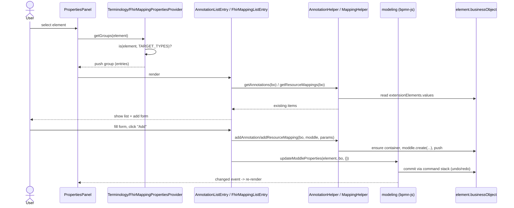

# 6. Runtime View

_Describes how building blocks interact and execute important use cases, critical interfaces, and error scenarios during system operation._

These libraries have no server and no long-running process. The "runtime" is the host bpmn-js modeler into which a consumer registers the `term:` / `fhirmap:` moddle extensions and properties-panel modules (see `examples/vanilla/src/app.js`). All scenarios below are derived from that demo app, the properties-panel providers/entries, the helper services, and the conformance roundtrip tool (`tools/moddle-roundtrip.mjs`).

The three core scenarios form one editing loop:

1. **Load** an annotated `.bpmn` — bpmn-moddle parses `extensionElements` into business objects.
2. **Select & edit** an element — properties-panel entries read the business object and write back via `modeling.updateModdleProperties`.
3. **Serialize** — `saveXML` re-emits the extensions losslessly (the moddle roundtrip).

## Scenario 1 — Load an annotated diagram

The consumer constructs a `BpmnModeler` with both extensions registered, then calls `importXML(xml)`. Because the `term:` and `fhirmap:` descriptors are passed in `moddleExtensions`, bpmn-moddle recognizes the namespaced elements inside `<bpmn2:extensionElements>` and materializes them as typed business objects (`term:Annotations`, `term:Annotation`, `term:Coding`, `fhirmap:ResourceMappings`, `fhirmap:ResourceMapping`, …) rather than discarding them.

```js
const modeler = new BpmnModeler({
  container: '#canvas',
  propertiesPanel: { parent: '#properties' },
  additionalModules: [
    BpmnPropertiesPanelModule,
    BpmnPropertiesProviderModule,
    TerminologyPropertiesPanelModule,
    FhirMappingPropertiesPanelModule
  ],
  moddleExtensions: {
    term: TerminologyModdleDescriptor,
    fhirmap: FhirMappingModdleDescriptor
  }
});

await modeler.importXML(annotatedBpmn); // term:/fhirmap: elements parsed into businessObjects
```

| Aspect | Behavior |
| --- | --- |
| Trigger | `modeler.importXML(xml)` |
| Precondition | `term` and `fhirmap` descriptors registered under `moddleExtensions` |
| Effect | `extensionElements.values` of each element contains typed `term:`/`fhirmap:` business objects |
| If a descriptor is missing | Unknown extension content is not materialized as typed objects (only standard BPMN survives); the roundtrip tool surfaces this as a parse warning / dropped-element count |

## Scenario 2 — Select an element and add an annotation / mapping

When the user selects a BPMN element, the properties panel asks each registered provider for its groups. `TerminologyPropertiesProvider` and `FhirMappingPropertiesProvider` both register at `LOW_PRIORITY` (500) and add their group only for their respective `TARGET_TYPES` (e.g. tasks, sub-processes, data object/store references; `term:` additionally covers events, `fhirmap:` additionally covers `bpmn:MessageFlow`).

The entry components read current state through the helper services (`getAnnotations` / `getResourceMappings`) and render existing items. On "add", they mutate the business object via the helper (`addAnnotation` / `addResourceMapping`, which lazily create the `bpmn:ExtensionElements` and the `term:Annotations` / `fhirmap:ResourceMappings` container as needed), then call `modeling.updateModdleProperties(element, bo, {})` to commit the change to the command stack and force a re-render. Removal works symmetrically (`removeAnnotation` / `removeResourceMapping` + `updateModdleProperties`).



| Aspect | Behavior |
| --- | --- |
| Read path | `useService('moddle' \| 'modeling' \| 'translate')`; `getAnnotations(bo)` / `getResourceMappings(bo)` |
| Create path | `moddle.create('term:Annotation' \| 'fhirmap:ResourceMapping', …)`; container created lazily if absent; `$parent` wired |
| Commit | `modeling.updateModdleProperties(element, bo, {})` — integrates with the bpmn-js command stack (undo/redo) |
| Group visibility | only for `TARGET_TYPES`; `isEdited` reflects whether a non-empty `term:Annotations` / `fhirmap:ResourceMappings` container exists |

## Scenario 3 — Serialize (lossless extension roundtrip)

`modeler.saveXML({ format: true })` walks the business objects and re-serializes them, including the `term:`/`fhirmap:` extension elements, back into valid BPMN 2.0 XML. The demo uses this both for the XML preview overlay and for the download button. Because the extensions live in standard `extensionElements`, the document remains openable by any compliant BPMN tool, which preserves the foreign namespaces on re-save.

The conformance gate verifies this roundtrip deterministically. `tools/moddle-roundtrip.mjs` registers the same two descriptors with a bare `BpmnModdle`, then for each `.bpmn` file:

1. `fromXML` (parse with `term:` + `fhirmap:` registered)
2. `toXML({ format: true })` → **A**
3. re-parse **A**, re-serialize → **B**
4. assert **A === B** (stable / idempotent serialization)
5. compare `<term:*>` / `<fhirmap:*>` element counts input vs **A** (detect dropped extension elements)
6. surface bpmn-moddle parse warnings (unknown/unparsable extension content)

| Outcome | Severity |
| --- | --- |
| Serialization not idempotent (A ≠ B) | FAIL (exit 1), always |
| A registered extension element dropped on parse (`inCount > outCount`) | FAIL (exit 1), always |
| bpmn-moddle parse warnings | WARN (exit 0) by default; FAIL under `--strict` |
| Parse error | FAIL (exit 1) |

This runs via `npm run check:roundtrip` (part of `npm run check:conformance` and `npm run verify`) and through the git hooks installed by `tools/setup-hooks.mjs`. `examples/vanilla` also offers `exportMappingsAsJson(elementRegistry)` (in `MappingHelper`) as a secondary, non-BPMN export path that flattens all `fhirmap:` mappings to JSON tagged with `fhirVersion: 'R4'`.

## Scenario 4 — Terminology search (Vue consumer)

This path is exercised by Vue consumers via the `useTerminology()` composable, not by the bundled properties-panel entries (which use static `TERMINOLOGY_PRESETS` and free-text code entry). A `TerminologyRegistry` is supplied through Vue `provide('terminologyRegistry', registry)`; the composable calls `registry.listProviders()` on mount and exposes async `search` / `searchAll` / `lookup` with reactive `searchResults`, `isSearching`, and `error` state. Registry calls delegate to the active provider; `SnomedCtProvider` and `FhirProvider` reach external servers (Snowstorm / a FHIR terminology server) through their adapters, while `StaticProvider` and the presets resolve locally with no network.

| Aspect | Behavior |
| --- | --- |
| Trigger | `search(term, systemId, options)` from a Vue component |
| Success | `searchResults.value = result.concepts`; `isSearching` toggled around the call |
| Provider error | caught: `error.value = err.message`, `searchResults.value = []` |
| No registry injected | `search` returns early (no-op); `searchAll` returns an empty `Map` |

## Error and edge scenarios

- **Demo load failure** — `loadSample()` in `app.js` wraps `importXML` in try/catch and logs `Failed to load diagram` to the console; there is no user-facing error UI in the demo.
- **Conformance failures** — handled deterministically by `moddle-roundtrip.mjs` as described in Scenario 3 (non-idempotent serialization, dropped extensions, parse warnings/errors).

_Requires human input: runtime error handling and recovery expectations for the libraries inside a production host modeler (e.g. behavior on adapter timeouts/HTTP errors from Snowstorm or a FHIR terminology server, retry/backoff policy, and concurrency or large-model performance targets) are not specified in code or configuration._

---

[← Architecture index](../ARCHITECTURE.md)
