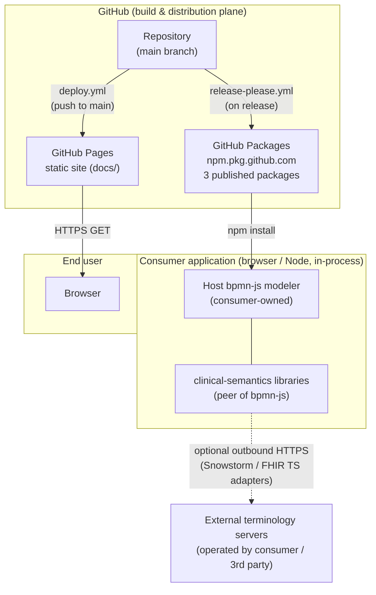

# 7. Deployment View

_Documents the technical infrastructure, deployment topology, and how software components map to physical or virtual execution environments._

## No Runtime Deployment — These Are Libraries

The artifacts produced by this monorepo are **bpmn-js extension libraries**, not a running service. There is no application server, database, container, message broker, or scheduled process to operate at runtime. The libraries execute **in-process** inside the host application that imports them (a bpmn-js modeler running in a browser or a Node tool).

Consequently this chapter describes two distinct things:

1. **Distribution of the libraries** as npm packages to a registry (build-time / publish-time), consumed via `npm install` by integrators.
2. **Deployment of the demo application** as static files to GitHub Pages — the only thing this repository itself "deploys".

The optional terminology adapters (`SnowstormAdapter`, `FhirTerminologyAdapter`, see [chapter 5](05_building_block_view.md)) make outbound HTTP calls to externally operated SNOMED CT (Snowstorm) and FHIR terminology servers. Those servers are **not part of this deployment** — they are provided and operated by the consuming application, and their base URLs are injected via provider configuration.

## Distributed Artifacts

| Artifact | Package name | Privacy | Registry |
|---|---|---|---|
| Terminology engine | `@forschungsgruppe-digital-health/terminology` | published | `https://npm.pkg.github.com` |
| FHIR mapping layer | `@forschungsgruppe-digital-health/fhir-mapping` | published | `https://npm.pkg.github.com` |
| Vue 3 wrapper | `@forschungsgruppe-digital-health/vue` | published | `https://npm.pkg.github.com` |
| Root workspace `clinical-bpmn` | — | `private: true` | not published |
| Demo `clinical-bpmn-demo` (`examples/vanilla`) | — | `private: true` | deployed as static site (not npm) |

All three published packages ship **raw ESM source** (`"type": "module"`, `main: src/index.js`) — there is no transpile/bundle step before publish. Each declares `publishConfig.registry = https://npm.pkg.github.com`, so they are published to **GitHub Packages** under the `@forschungsgruppe-digital-health` scope (scope == owning GitHub org, as required by GitHub Packages). bpmn-js, the properties panel, and (for the Vue package) Vue 3 are `peerDependencies` supplied by the consumer, not bundled.

## Topology



## Demo Deployment (GitHub Pages)

The interactive demo is the single deployable unit owned by this repository. It is defined in `examples/vanilla` and deployed by `.github/workflows/deploy.yml` on every push to `main`.

| Property | Value | Source |
|---|---|---|
| Trigger | push to `main` | `deploy.yml` (`on.push.branches`) |
| Pre-deploy gate | full test suite on Node 18 **and** 20 (`test` job) | `deploy.yml` |
| Build tool | Vite 6 (`vite build`) | `examples/vanilla/package.json`, `vite.config.js` |
| Output directory | `docs/` (repo root) | `vite.config.js` (`build.outDir: ../../docs`, `emptyOutDir`) |
| Base path | `/bpmn-js-clinical-semantics/` | `vite.config.js` (`base`) |
| Publish mechanism | `actions/upload-pages-artifact` → `actions/deploy-pages` | `deploy.yml` |
| Concurrency | group `pages`, `cancel-in-progress` | `deploy.yml` |
| Live URL | `https://forschungsgruppe-digital-health.github.io/bpmn-js-clinical-semantics/` | README / CONTRIBUTING |

The Vite `base` matches the GitHub Pages project-site path segment, so asset URLs resolve correctly under the org subdomain. The `docs/` build output is generated, not committed. Required Pages configuration (Settings → Pages → Source = **GitHub Actions**) is one-time repo setup, documented in CONTRIBUTING.

## Package Publishing (GitHub Packages)

Publishing is driven by **release-please** in a single workflow (`.github/workflows/release-please.yml`), configured by `release-please-config.json` and `.release-please-manifest.json`.

```text
push to main ──▶ release-please-action maintains a release PR
                 (collects Conventional Commits, computes version bumps)
                          │  merge release PR
                          ▼
                 tag + GitHub Release  (releases_created = true)
                          │
                          ▼
                 publish job (gated on releases_created)
                          │  setup-node (registry-url + scope) writes .npmrc
                          ▼
   npm publish --workspace=packages/terminology   ┐
   npm publish --workspace=packages/fhir-mapping  ├──▶ GitHub Packages
   npm publish --workspace=packages/vue           ┘    (npm.pkg.github.com)
```

Configuration facts derived from `release-please-config.json`:

- Three release-tracked components (`terminology`, `fhir-mapping`, `vue`), all `release-type: node`, currently at `0.1.0` per the manifest.
- **`linked-versions`** plugin groups all three under `clinical-bpmn`, so they share a single version line.
- **`node-workspace`** plugin (`updatePeerDependencies: true`) keeps the internal `peerDependencies` ranges (e.g. the Vue package's optional peers on `terminology`/`fhir-mapping`) in sync on bump.
- `separate-pull-requests: false` and `include-component-in-tag: false` → one consolidated release PR/tag rather than per-package.

Publish job specifics (`release-please.yml`):

- Runs only when `releases_created == 'true'`; uses `permissions: packages: write`.
- Auth via the workflow's built-in `secrets.GITHUB_TOKEN` exposed as `NODE_AUTH_TOKEN`; `actions/setup-node` writes `@forschungsgruppe-digital-health:registry=https://npm.pkg.github.com` into `.npmrc`. No long-lived publish token is stored in the repo.
- **Raw-src publish** (no build step before `npm publish`); each workspace is published explicitly and in order, so the two `private: true` workspaces are never published.

## Continuous Integration (build/test plane)

`.github/workflows/ci.yml` runs on pushes and PRs to `main` and gates what is later deployed/published:

- **`build-and-test`** job — matrix on **Node 18 and 20** (`runs-on: ubuntu-latest`): `npm ci --legacy-peer-deps`, lint (non-blocking), `npm test`, `npm run build` (demo).
- **`conformance`** job (Node 20) — blocking gates: `check:conformance` (bpmnlint structural lint + lossless moddle roundtrip + informational XSD core validation via `xmllint`), `check:packages` (npm/bpmn.io packaging conventions), and `npm audit --omit=dev --audit-level=high` (production-dependency CVE gate). See `tools/` and [chapter 8](08_crosscutting_concepts.md).

Action versions are pinned by commit SHA. `--legacy-peer-deps` is used throughout because the bpmn-js peer ranges cannot be satisfied by npm's strict resolver.

## Execution Environments

| Environment | What runs | Operated by |
|---|---|---|
| GitHub Actions (`ubuntu-latest`, Node 18/20) | CI, conformance, demo build, release/publish | this project (CI) |
| GitHub Pages (org static hosting) | the built demo (`docs/`) | this project |
| GitHub Packages (`npm.pkg.github.com`) | the three published npm packages | this project (publish), integrators (consume) |
| Consumer host app (browser or Node) | the libraries, in-process as a bpmn-js peer | integrator |
| External SNOMED CT (Snowstorm) / FHIR terminology servers | optional outbound lookups from the adapters | consumer / third party (not this repo) |

## Aspects Not Derivable From the Repository

- _Requires human input: production deployment topology / hosting of any consuming application that embeds these libraries (out of scope for this repo)._
- _Requires human input: which concrete terminology server endpoints (Snowstorm / FHIR TS) a deployment is expected to target, their availability/SLA, and authentication to them._
- _Requires human input: sizing, scaling, and availability targets — there is no server component in this repository to size._

---

[← Architecture index](../ARCHITECTURE.md)
