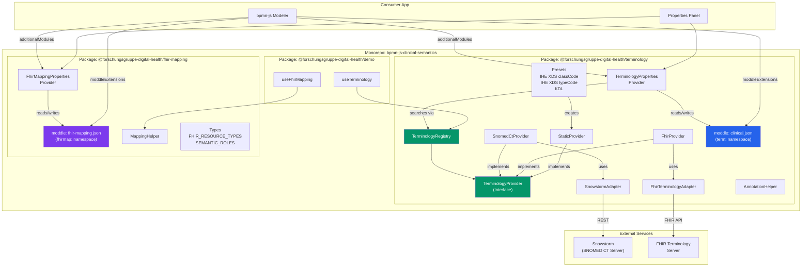

# 3. Context and Scope

_Defines system boundaries, identifies external interfaces, communication partners, and clarifies what is inside versus outside the system._

## Package Overview

## Business Context

_Requires human input_ — institutional actors (e.g. clinical modeller, terminology steward, hospital/IHE registry operator) and the business artefacts exchanged (clinical pathway models, terminology bindings, FHIR mappings) are not derivable from code/config.

## Technical Context

External interfaces (communication partners) of the system:

| Partner | Relationship | Channel / Operation | Local adapter / entry point |
| --- | --- | --- | --- |
| Snowstorm (SNOMED CT server) | outbound | REST | `SnowstormAdapter` (`packages/terminology/src/adapters/SnowstormAdapter.js`) |
| FHIR terminology server | outbound | FHIR `$expand` / `$lookup` | `FhirTerminologyAdapter` (`packages/terminology/src/adapters/FhirTerminologyAdapter.js`) |
| Host bpmn-js modeler | in-process | `additionalModules` / `moddleExtensions` | `examples/vanilla/src/app.js` |

---

[← Architecture index](../ARCHITECTURE.md)
