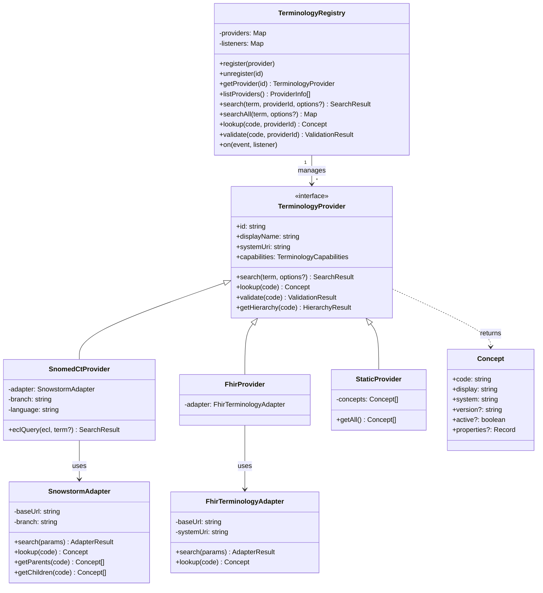

# 5. Building Block View

_Shows the static decomposition of the system into modules, components, subsystems, and their dependencies across multiple abstraction levels._

## Terminology Provider Architecture



## Project Structure

```
bpmn-js-clinical-semantics/
|
+-- packages/
|   +-- terminology/                  @forschungsgruppe-digital-health/terminology
|   |   +-- src/
|   |   |   +-- core/                 TerminologyProvider (interface), TerminologyRegistry, types
|   |   |   +-- adapters/             SnowstormAdapter, FhirTerminologyAdapter
|   |   |   +-- providers/            SnomedCtProvider, FhirProvider, StaticProvider
|   |   |   |   +-- presets/          Factory functions for IHE XDS classCode/typeCode, KDL
|   |   |   +-- moddle/               clinical.json  -- BPMN moddle extension (term: namespace)
|   |   |   +-- properties-panel/     TerminologyPropertiesProvider, UI entries
|   |   |   +-- services/             AnnotationHelper (read/write annotations on businessObjects)
|   |   +-- test/                     Unit tests
|   |
|   +-- fhir-mapping/                 @forschungsgruppe-digital-health/fhir-mapping
|   |   +-- src/
|   |   |   +-- core/                 types (FHIR_RESOURCE_TYPES, INTERACTIONS, DIRECTIONS, SEMANTIC_ROLES)
|   |   |   +-- moddle/               fhir-mapping.json  -- BPMN moddle extension (fhirmap: namespace)
|   |   |   +-- properties-panel/     FhirMappingPropertiesProvider, UI entries
|   |   |   +-- services/             MappingHelper (read/write/export FHIR mappings)
|   |   +-- test/                     Unit tests
|   |
|   +-- demo/                         @forschungsgruppe-digital-health/demo (private, not published)
|       +-- src/composables/          useTerminology(), useFhirMapping()
|
+-- examples/
|   +-- vanilla/                      Interactive demo app (Vite + bpmn-js)
|   |   +-- src/app.js                Modeler setup with both extensions
|   |   +-- public/sample.bpmn        Sample lung cancer diagnostic pathway
|   |   +-- index.html                Demo UI
|   +-- minimal/                      Lung-cancer staging fixtures (no build step)
|       +-- lung-cancer-staging.bpmn           Plain BPMN pathway
|       +-- lung-cancer-staging-annotated.bpmn term:/fhirmap: annotated variant
|       +-- lung-cancer-staging-fhir.json      Exported FHIR mapping
|
+-- docs/                             Tracked documentation home (arc42 chapters under
|                                     docs/arc42/, docs/ARCHITECTURE.md,
|                                     docs/EXTENDING.md, docs/user-stories/)
|                                     -- the built GitHub Pages site goes to site/ (gitignored)
|
+-- .github/
|   +-- workflows/
|       +-- ci.yml                    CI: lint, test, build (Node 18 + 20) + conformance job
|       +-- deploy.yml                GitHub Pages deployment on push to main
|       +-- release-please.yml        Release PR + per-component tags/releases
|       +-- publish.yml               Publish to GitHub Packages on release: published
|
+-- ARCHITECTURE.md                   Architecture index (docs/ARCHITECTURE.md)
+-- CONTRIBUTING.md                   Development, packaging, and release guide
+-- LICENSE                           Apache License 2.0
+-- README.md                         Project overview and quick start
```

**Why two publishable packages plus the private `demo` package?** The terminology engine and the FHIR mapping layer solve different problems and have different dependency footprints. A project that only needs terminology search (e.g. a coding assistant widget) should not be forced to pull in FHIR mapping types. Conversely, a project that only needs to declare resource-level FHIR mappings does not need the Snowstorm adapter or FHIR terminology client. These two (`terminology`, `fhir-mapping`) are the publishable packages. The `demo` package is framework-specific and only relevant to Vue 3 consumers; it is private (`@forschungsgruppe-digital-health/demo`, not published). The monorepo structure keeps development convenient while allowing independent consumption.

## Package Details

### `@forschungsgruppe-digital-health/terminology`

Extensible terminology annotation engine. Each BPMN element can carry multiple annotations, each with:

- **`aspect`** -- which semantic facet is annotated: `clinicalContent`, `documentClass`, `documentType`, `note`, `confidentiality`, `status`, `format`, `participant`, or custom values
- **`mode`** -- `descriptive` (documentation only) or `prescriptive` (normative, with optional mapping target)
- **`text`** -- free-text description (always available, no code system required)
- **`codings`** -- 0..* codes from any registered terminology system
- **`target`** -- optional FHIRPath mapping rule with `element`, `transform` (`copy` | `fixed` | `translate` | `reference`), and `value`

**Included providers:**

| Provider | Class | Server required | Codes |
|---|---|---|---|
| SNOMED CT | `SnomedCtProvider` | Yes (Snowstorm) | via API |
| LOINC, ICD-10-GM, OPS, ATC, ICD-O-3 | `FhirProvider` | Yes (any FHIR TS) | via API |
| IHE XDS classCode | `createIheXdsClassCodeProvider()` | No | 16 built-in |
| IHE XDS typeCode | `createIheXdsTypeCodeProvider()` | No | 22 built-in |
| KDL (DVMD) | `createKdlProvider()` | No | 18 built-in (full set loadable from FHIR) |

Adding a new terminology system requires zero changes to existing code. Implement `TerminologyProvider` and call `registry.register()`. For FHIR-hosted code systems, reuse `FhirProvider`. For small static code systems, use `StaticProvider`.

### `@forschungsgruppe-digital-health/fhir-mapping`

FHIR resource-level mapping. Each BPMN element can declare:

- **`resourceType`** -- which FHIR resource it represents (16 types including `Condition`, `Procedure`, `Observation`, `DiagnosticReport`, `DocumentReference`, `MedicationRequest`, `ServiceRequest`, `CarePlan`, `Composition`, `Bundle`, `ImagingStudy`, `Consent`, `Patient`, `Encounter`, `Specimen`)
- **`profile`** -- canonical URL of the applicable FHIR profile (e.g. MII KDS profiles)
- **`interaction`** -- FHIR interaction type: `create`, `read`, `update`, `search`, `transaction`
- **`direction`** -- data flow direction: `input`, `output`, `input-output`
- **`structureMapRef`** -- canonical URL of a FHIR StructureMap for automated transformation
- **`keyElements`** -- FHIRPath elements with semantic roles (`trigger`, `filter`, `classifier`, `identifier`, `payload`), fixed values, and terminology bindings
- **`searchParams`** -- FHIR SearchParameters for `search`-type interactions

### `@forschungsgruppe-digital-health/demo`

Thin Vue 3 wrapper providing `useTerminology()` and `useFhirMapping()` composables for building custom sidebars or search UIs. Both composables react to the bpmn-js selection and expose reactive state.

---

[← Architecture index](../ARCHITECTURE.md)
