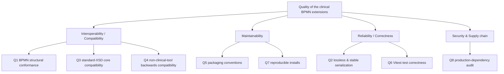

# 10. Quality Requirements

_Defines quality goals, quality scenarios, and requirements for performance, security, usability, and other non-functional attributes._

This chapter lists the quality requirements that the repository **actually enforces or targets** today, derived from the conformance tooling (`tools/`), the CI workflows (`.github/workflows/`), the git hooks (`.githooks/`), the moddle descriptors (`packages/*/src/moddle/*.json`) and the package manifests. Quality goals stated as design principles (the gap between BPMN and clinical semantics, the SOLID breakdown, the separate-namespace decision) are described in chapters [1](01_introduction_and_goals.md), [4](04_solution_strategy.md) and [8](08_crosscutting_concepts.md) and are not repeated here.

Anything that is a domain or business decision — quantitative targets, prioritised trade-offs, an explicit quality tree with stakeholder weighting — is **not derivable from the repo** and is marked `_Requires human input_`.

## 10.1 Quality Goals (enforced by the repo)

The repository implements a single, deterministic **quality gate** (one set of CLI tools under `tools/`, wired to npm scripts, run identically in the terminal, git hooks, VS Code tasks and CI — "the decision lives in the tool, never in the model"). The gate operationalises the following goals.

| ID | Quality goal | How the repo enforces / targets it | Blocking? |
|---|---|---|---|
| Q1 | **BPMN 2.0 structural conformance** | `bpmnlint` over all discovered `.bpmn` files, config `.bpmnlintrc` = `bpmnlint:recommended` + `bpmnlint:correctness` (connectedness, start/end events, no implicit splits, no dangling refs) via `tools/lint-bpmn.mjs` | Yes |
| Q2 | **Lossless & stable extension serialization** | `tools/moddle-roundtrip.mjs` parses each file with the `term:` + `fhirmap:` moddle metamodel registered, serializes (A), re-parses + re-serializes (B), asserts `A === B` (idempotent) and that no registered extension element is dropped on parse | Yes (on instability or dropped registered element) |
| Q3 | **Standard-XSD core compatibility** | `tools/validate-xsd.sh` validates the BPMN core of each file against the OMG `BPMN20.xsd` shipped with `bpmn-moddle`, using `xmllint` | No — **informational** (see Q3 note) |
| Q4 | **Backwards-compatibility with non-clinical BPMN tools** | Clinical data lives only in `<extensionElements>` under custom prefixes (`term:`, `fhirmap:`); the moddle types `extend` standard BPMN elements rather than altering the core (`clinical.json`, `fhir-mapping.json`); separate namespace URIs keep the two layers independent (AGENTS.md hard rule) | Yes, structurally (Q1+Q2+Q3 together) |
| Q5 | **Packaging conventions for publishing** | `tools/check-package-conventions.mjs` checks every `packages/*` for accepted name prefix, `"type": "module"` (raw ESM), a declared license and an entry point (`main`/`exports`); warns on missing `exports`, `peerDependencies`, `repository.directory`, `publishConfig.registry` | Yes (errors); warnings non-blocking |
| Q6 | **Automated test correctness (Vitest)** | `npm test` runs the Vitest suites across workspaces; CI runs them on the Node 18 **and** Node 20 matrix; the GitHub Pages deploy is gated on the tests passing first | Yes |
| Q7 | **Reproducible installs** | `npm ci --legacy-peer-deps` in CI (lockfile-driven); engines pinned to `node >=18`; `prepare` installs the committed git hooks via `core.hooksPath` | Yes (CI) |
| Q8 | **Supply-chain hygiene of shipped dependencies** | CI step `npm audit --omit=dev --audit-level=high` fails on high/critical CVEs in production (shipped) dependencies; dev-only advisories are tracked separately and do not block | Yes |

**Q3 note — why XSD is informational.** The standard `BPMN20.xsd` accepts arbitrary content inside `<extensionElements>` via `processContents="lax"`, so a green XSD result does **not** prove the clinical extensions are valid — that verdict comes from the Q2 moddle roundtrip. The XSD layer therefore runs in informational mode by default; `bash tools/validate-xsd.sh --strict` (and `node tools/moddle-roundtrip.mjs --strict`) promote the soft signals to hard failures when standard-core conformance must be enforced.

### Quality tree (overview)

This tree reflects only the relationships **evident in the tooling**; it is not a prioritised/weighted quality tree (priorities are a stakeholder decision — see 10.3).

## 10.2 Quality Scenarios

Expressed in the arc42 scenario form (stimulus → response). These are derivable because each is exactly what a tool in `tools/` checks; the response is the tool's defined exit behaviour.

### Q1 — BPMN structural conformance

> **Scenario.** A contributor edits or adds a `.bpmn` file under a discovered root and stages it for commit.
> **Response.** The pre-commit hook runs `check:conformance`, which runs `bpmnlint` (`recommended` + `correctness`). A structurally invalid diagram (disconnected node, missing start/end event, dangling reference, implicit split) **fails the commit** (non-zero exit). The same check blocks the PR in CI.

### Q2 — Lossless & stable extension serialization

> **Scenario.** A `.bpmn` file carries `term:` annotations and/or `fhirmap:` mappings and is round-tripped through the moddle metamodel.
> **Response.** `moddle-roundtrip.mjs` requires `A === B` (re-serialization is idempotent) and that the count of `<term:*>`/`<fhirmap:*>` elements does not drop on parse. Instability or a dropped registered element is a **hard failure (exit 1)**. `bpmn-moddle` parse warnings for extension content not defined in the model are surfaced as **warnings (exit 0)** by default, and become failures under `--strict`.

### Q3 — Standard-XSD core compatibility

> **Scenario.** A `.bpmn` file is validated against the OMG `BPMN20.xsd`.
> **Response.** `validate-xsd.sh` reports per-file PASS/FAIL for the BPMN **core** only. By default it exits 0 even on a schema-invalid core (informational), because the standard XSD cannot judge extension content; `--strict` makes a schema-invalid core fail (exit 1). The check is skipped gracefully when `node` or `xmllint` is unavailable.

### Q4 — Backwards-compatibility with non-clinical BPMN tools

> **Scenario.** An annotated diagram is opened, edited and re-saved in a BPMN 2.0 tool that does not understand the `term:`/`fhirmap:` namespaces.
> **Response.** Because all clinical data is confined to `<extensionElements>` under custom prefixes and the moddle types only `extend` standard BPMN elements (they never alter `bpmn:`/`bpmndi:` structure), the diagram remains valid BPMN 2.0 (Q1/Q3) and the extension content survives a round-trip (Q2). The repo enforces the structural side of this; whether a specific third-party tool preserves unknown `extensionElements` on re-save is a property of that tool and is **not tested in this repo** (no end-to-end third-party-tool test exists). _Requires human input: the explicit list of third-party BPMN tools that must preserve the extensions, and any acceptance test against them._

### Q5 — Packaging conventions

> **Scenario.** A contributor edits any `package.json`, or prepares a release.
> **Response.** The pre-commit hook runs `check:packages`. A publishable `packages/*` package missing an accepted name prefix (`@forschungsgruppe-digital-health/*`, `bpmn-js-*`, `bpmnlint-plugin-*`), missing `"type": "module"`, missing a license, or missing any entry point **fails** (exit 1). Missing `exports`/`peerDependencies`/`repository.directory`/`publishConfig.registry` produce non-blocking warnings. Private packages (repo root, demo) are exempt from publish rules but still must be ESM.

### Q6 — Automated test correctness

> **Scenario.** A change is pushed / a PR is opened against `main`.
> **Response.** CI runs `npm test` (Vitest) on a Node **18 and 20** matrix and then builds the demo. The pre-push hook runs the full `npm run verify` (`check:packages` + `check:conformance` + `npm test`) locally. The GitHub Pages deploy runs the test matrix first and only deploys on success. _Note: properties-panel modules and the `demo` package are excluded from unit tests by design (they require live bpmn-js peers) — see [CONTRIBUTING.md](../../CONTRIBUTING.md#testing); UI behaviour is exercised through the demo app, not Vitest._

### Q7 — Reproducible installs

> **Scenario.** CI provisions a clean environment.
> **Response.** `npm ci --legacy-peer-deps` installs from the committed lockfile (deterministic). The `--legacy-peer-deps` flag is required because the bpmn-js / bpmn-js-properties-panel peer ranges cannot be satisfied by npm's strict resolver. `engines.node` is `>=18`.

### Q8 — Supply-chain hygiene

> **Scenario.** CI evaluates the shipped dependency tree.
> **Response.** `npm audit --omit=dev --audit-level=high` fails the conformance job on a high/critical advisory in a **production** dependency. Dev-only advisories are reported elsewhere and do not block.

## 10.3 Quantitative targets and prioritisation (not derivable)

The repository encodes **pass/fail gates**, not measured quality targets or a prioritised trade-off ranking. The following are therefore not derivable from code and require human input:

- _Requires human input: performance / latency / throughput targets (e.g. terminology search response time against Snowstorm or a FHIR terminology server, properties-panel interaction latency, max diagram size). None are specified or measured anywhere in the repo._
- _Requires human input: a test-coverage threshold. The suite uses Vitest and CONTRIBUTING.md states a coverage **aim** (all public API functions, all provider/adapter paths, all helper CRUD ops) but defines no enforced numeric coverage gate._
- _Requires human input: usability / accessibility requirements for the properties panel and Vue UI (a11y conformance level, i18n languages beyond the German group labels visible in the demo)._
- _Requires human input: availability / reliability targets for the external terminology services (Snowstorm, FHIR TS) and the documented behaviour when they are unreachable._
- _Requires human input: the relative **priority / trade-off ranking** of the quality goals above (e.g. compatibility vs. maintainability vs. feature velocity), including the project's risk appetite. This is a stakeholder decision (see chapter [1](01_introduction_and_goals.md))._
- _Requires human input: security requirements beyond the supply-chain audit (e.g. threat model, handling of credentials/tokens for terminology servers). Note the project's hard rule that only synthetic clinical data is permitted and the "research prototype — not production-hardened, not independently security-reviewed" status stated in the [README](../../README.md)._

---

[← Architecture index](../ARCHITECTURE.md)
