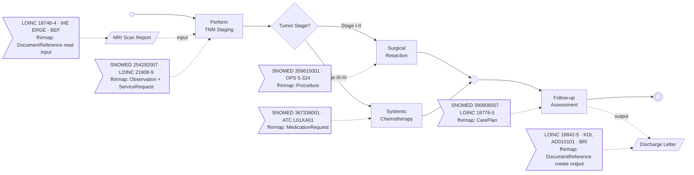
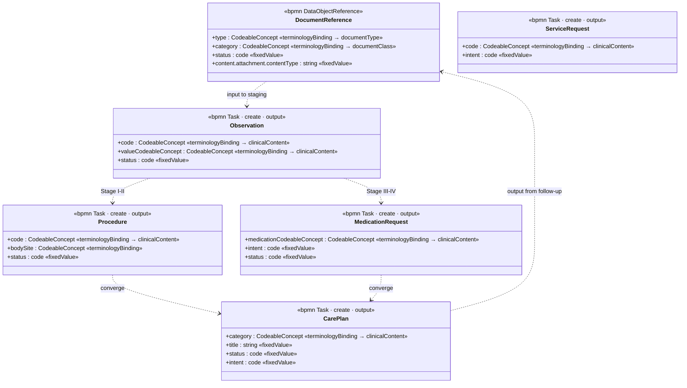
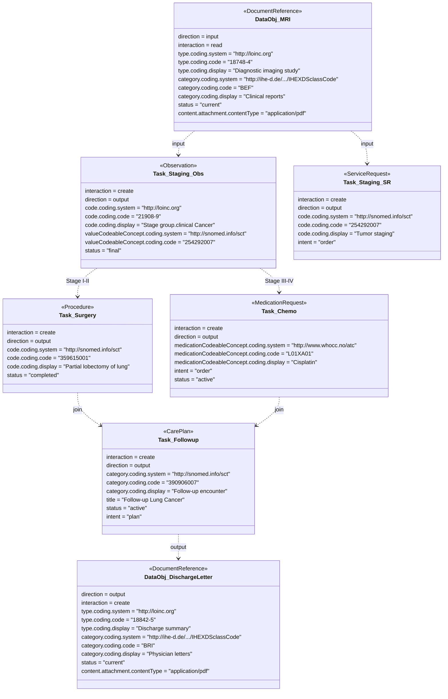

# Minimal Example: Lung Cancer Treatment Decision

This directory contains a minimal, self-contained example that demonstrates the mapping between BPMN process models and FHIR R4 resources. It is intended for onboarding new developers and for testing the `fhirmap:` extension.

## Clinical Scenario

A simplified lung cancer treatment pathway based on TNM staging:



After TNM staging determines the tumor stage, the pathway branches: early-stage (I–II) patients receive surgical resection (lobectomy), while advanced-stage (III–IV) patients receive platinum-based chemotherapy. Both paths converge into a follow-up assessment.

The process also demonstrates BPMN data objects: an MRI scan report serves as input to the staging task, and a discharge letter is produced as output of the follow-up assessment. Both map to FHIR DocumentReference resources.

## Files

| File | Description |
|---|---|
| `lung-cancer-staging.bpmn` | Plain BPMN 2.0 XML — the base process with no clinical extensions. Start here to understand the BPMN structure. |
| `lung-cancer-staging-fhir.json` | FHIR R4 transaction Bundle — the same pathway expressed as FHIR resources (PlanDefinition, ActivityDefinitions, ObservationDefinition, ValueSet, DocumentReferences). |
| `lung-cancer-staging-annotated.bpmn` | Annotated BPMN 2.0 XML — the base process enriched with `term:` (terminology) and `fhirmap:` (FHIR mapping) extension elements. |

## BPMN ↔ FHIR Mapping

| BPMN Element | BPMN Type | FHIR Resource | Key Details |
|---|---|---|---|
| `DataObj_MRI` | DataObjectReference | DocumentReference | MRI scan report input (LOINC 18748-4, IHE XDS ERGE) |
| `Task_Staging` | Task | Observation, ServiceRequest | TNM stage output (LOINC 21908-9), ServiceRequest for staging order |
| `Gateway_Split` | XOR Gateway | PlanDefinition.action (selectionBehavior=exactly-one) | Nested actions with FHIRPath applicability conditions |
| `Task_Surgery` | Task | Procedure | Lobectomy (SNOMED 359615001, OPS 5-324) |
| `Task_Chemo` | Task | MedicationRequest | Cisplatin (ATC L01XA01) |
| `Task_Followup` | Task | CarePlan | Follow-up care plan |
| `DataObj_DischargeLetter` | DataObjectReference | DocumentReference | Discharge letter output (LOINC 18842-5, KDL AD010101) |

## Information Model (UML Class Diagram)

The following class diagram shows the FHIR R4 resource types produced or consumed by the process. Each class carries a `<<stereotype>>` indicating the BPMN element type and interaction pattern. Attributes are annotated with their value source: `terminologyBinding` resolves at runtime from `term:coding`, while `fixedValue` is a FHIR-structural constant.



## Instance Data (UML Object Diagram)

Concrete attribute values for each FHIR resource instance in this example. Each object carries its terminology codes and fixed values as populated from the annotated BPMN.



## FHIR Bundle Structure

```
Bundle (transaction)
├── PlanDefinition           — the pathway (references all ActivityDefinitions)
│   ├── action: TNM-Staging  → definitionCanonical → ActivityDefinition/tnm-staging
│   ├── action: Treatment Decision (selectionBehavior=exactly-one)
│   │   ├── action: Surgery  → definitionCanonical → ActivityDefinition/surgery
│   │   └── action: Chemo    → definitionCanonical → ActivityDefinition/chemo
│   └── action: Follow-up   → definitionCanonical → ActivityDefinition/followup
├── ActivityDefinition/tnm-staging     (kind: ServiceRequest)
│   └── observationResultRequirement → ObservationDefinition
├── ObservationDefinition/tnm-stage
│   └── validCodedValueSet → ValueSet
├── ValueSet/tnm-stage-group           (SNOMED CT stage codes)
├── ActivityDefinition/surgery         (kind: ServiceRequest, code: lobectomy)
├── ActivityDefinition/chemo           (kind: MedicationRequest, product: cisplatin)
├── ActivityDefinition/followup        (kind: CarePlan)
├── DocumentReference/mri-report       (input to staging: MRI scan report)
└── DocumentReference/discharge-letter (output of follow-up: Discharge Letter)
```

All `definitionCanonical` and `reference` values resolve within the Bundle via `urn:uuid:` fullUrls.

## Extension Elements in the Annotated BPMN

The annotated BPMN uses two independent XML namespaces:

**`term:` (terminology annotations)** — codes from SNOMED CT, LOINC, OPS, ATC on each task, with `id` and optional free text. The `term:` namespace is purely semantic — it carries no FHIR paths or transforms.

**`fhirmap:` (FHIR resource mappings)** — declares which FHIR resource type, profile, interaction, and key elements each BPMN task or data object produces/consumes. Key elements use FHIRPath paths, semantic roles (trigger, classifier, payload), and one of: `fixedValue` (FHIR-structural constants like status/intent) or `terminologyBinding`+`id` (resolved from `term:annotation` by id).

Both namespaces extend `DataObjectReference` in addition to `FlowNode`, so data objects like the MRI report and discharge letter carry the same annotation structure as tasks.

Example from `Task_Staging`:

```xml
<bpmn2:task id="Task_Staging" name="Perform TNM Staging" term:clinicalDomain="staging">
  <bpmn2:extensionElements>
    <term:annotations>
      <term:annotation id="term-ann-1"
                       text="Clinical TNM staging ...">
        <term:coding system="http://snomed.info/sct" code="254292007" display="Tumor staging"/>
        <term:coding system="http://loinc.org" code="21908-9" display="Stage group.clinical Cancer"/>
      </term:annotation>
    </term:annotations>
    <fhirmap:resourceMappings>
      <fhirmap:resourceMapping resourceType="Observation" interaction="create" direction="output">
        <fhirmap:keyElement path="Observation.code" semanticRole="classifier"
                           terminologyBinding="term-ann-1"/>
        <fhirmap:keyElement path="Observation.status" semanticRole="trigger"
                           fixedValue="final"/>
      </fhirmap:resourceMapping>
    </fhirmap:resourceMappings>
  </bpmn2:extensionElements>
</bpmn2:task>
```

Example from `DataObj_MRI` (data object with DocumentReference mapping):

```xml
<bpmn2:dataObjectReference id="DataObj_MRI" name="MRI Scan Report" term:clinicalDomain="diagnostics">
  <bpmn2:extensionElements>
    <term:annotations>
      <term:annotation id="term-ann-1" mode="prescriptive"
                       text="MRI scan report of the thorax ...">
        <term:coding system="http://loinc.org" code="18748-4" display="Diagnostic imaging study"/>
      </term:annotation>
    </term:annotations>
    <fhirmap:resourceMappings>
      <fhirmap:resourceMapping resourceType="DocumentReference" interaction="read" direction="input">
        <fhirmap:keyElement path="DocumentReference.type" semanticRole="classifier"
                           terminologyBinding="term-ann-1"/>
        <fhirmap:keyElement path="DocumentReference.status" semanticRole="trigger"
                           fixedValue="current"/>
      </fhirmap:resourceMapping>
    </fhirmap:resourceMappings>
  </bpmn2:extensionElements>
</bpmn2:dataObjectReference>
```

## How to Use

**View the plain BPMN** — open `lung-cancer-staging.bpmn` in the demo app or any BPMN viewer to see the process structure without clinical annotations.

**View the annotated BPMN** — open `lung-cancer-staging-annotated.bpmn` in the demo app. The terminology panel and FHIR mapping panel will display the annotations on each element.

**Inspect the FHIR Bundle** — open `lung-cancer-staging-fhir.json` in any FHIR viewer or JSON editor. The PlanDefinition.action hierarchy mirrors the BPMN process flow.

**Run programmatic tests:**

```bash
# From the repo root
npm test
```

## Terminology Systems Used

| System | URI | Used For |
|---|---|---|
| SNOMED CT | `http://snomed.info/sct` | Clinical procedures, substances, body structures |
| LOINC | `http://loinc.org` | Observation codes, care plan notes, document types |
| OPS | `http://fhir.de/CodeSystem/bfarm/ops` | German procedure codes |
| ATC | `http://www.whocc.no/atc` | Medication classification |
| IHE XDS classCode | `http://ihe-d.de/CodeSystems/IHEXDSclassCode` | Document class (BEF, BRI) |
| IHE XDS typeCode | `http://ihe-d.de/CodeSystems/IHEXDStypeCode` | Document type (ERGE) |
| KDL | `http://dvmd.de/fhir/CodeSystem/kdl` | German clinical document types |
